## ORIE 4741 FINAL REPORT

Christopher Archer (caa234), Zoe Pan (zp45), Jia Jiunn Ang (ja497)

### I. Introduction

On any campaign, it is vital to strategically allocate resources to ensure a victory while minimizing overall cost. We have data consisting of electoral numbers for every county in America along with demographic information such as education level, migration rate, and median income. In this paper, our goal is to create an understanding of this dataset, with the intention of ultimately creating a classifier for _swing counties_, counties that are most likely to switch their vote from election to election. This could be especially useful for campaigns, as those counties would be the target of the bulk of their advertising resources.

### II. The Dataset

Our data is split into three separate files. The first two, _county\_data\_2012.csv_ and _county\_data\_2016.csv_, are simply the demographic info of all counties from the 2012 and 2016 presidential elections. The columns of this dataset are: County, Democratic votes (DEM), Republican votes (GOP), Median Income, Migration Rate, Birth Rate, Death Rate, Bachelor Rate (% with bachelor&#39;s degree), and Unemployment Rate. Some extra preprocessing was done such that only counties eligible to vote are included, leaving us with 3143 counties overall. These data were also merged with county geodata such as county latitude, longitude, primary city, and estimated population. It is important to note that after preprocessing, 73 counties had missing electoral information - this could be a source of bias. We use the geocoded data to reconstruct an &quot;election map&quot; below.

  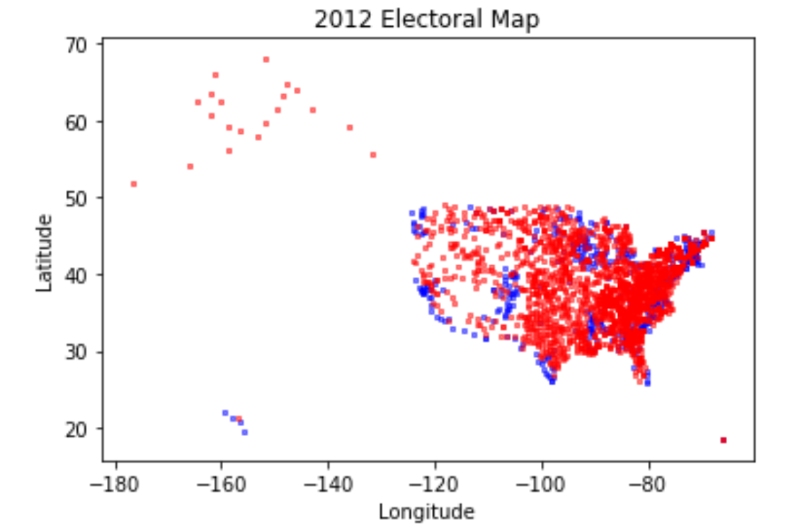
  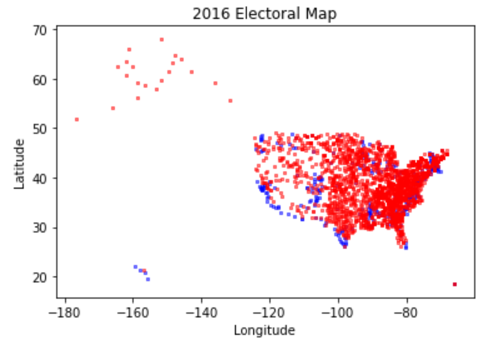

Our third dataset _county\_graph.csv_ contains pairs of counties, where pair _(i,j)_ represents whether county _i_ shares a border with county _j_. This can be used to represent the United States counties as an undirected graph, which has many interesting implications for modeling.

### III. Understanding the Data

For some initial data visualizations, we decided to focus on the 2016 dataset (since demographics haven&#39;t changed that much since 2012). Our group thought it would be interesting to create distributions of each column based on region and see if there was anything significantly different, and if we could find a location reason for voting preference.

There are a few notable differences in the visualizations. In the Median Income and Bachelor Rate histograms, we can see that the mean of the South region is slightly lower than the rest of the regions. In the Migration Rate histogram, the West region has a slightly higher migration rate compared to the other regions. In the Birth and Death Rate histograms, the Northeast region is slightly lower than the rest of the regions. Overall, most of the histograms didn&#39;t have significant differences among regions.

  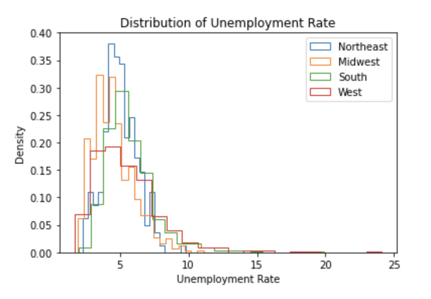
  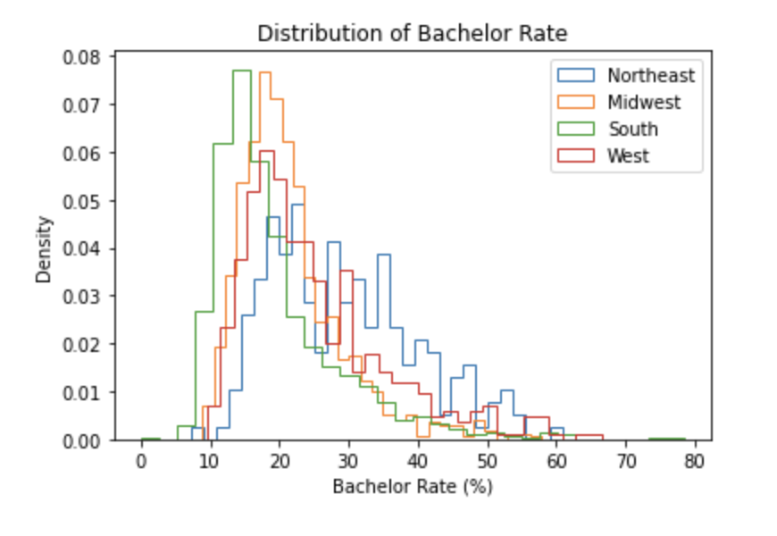

  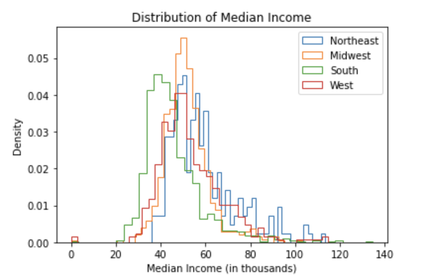
  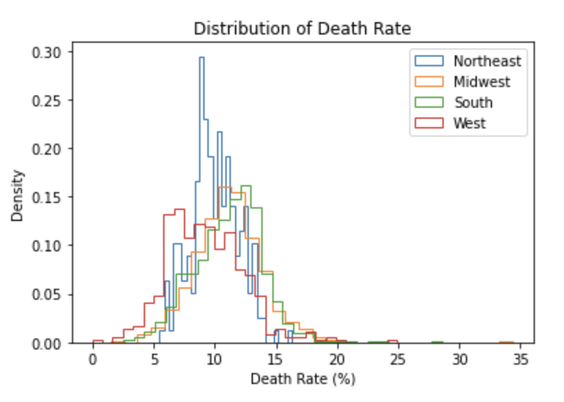

In another attempt to further understand our data, we created box plots for demographic information split on which party the county&#39;s majority voted for. Among our features, we only found Bachelor&#39;s Rate and Death Rate to be significantly different, as shown below.

  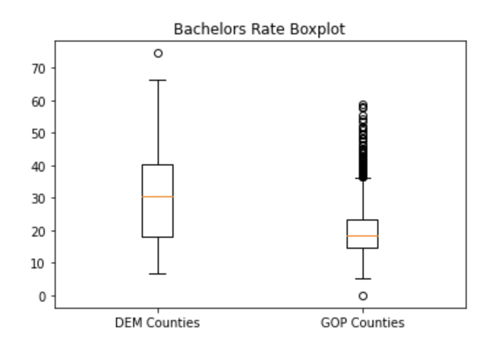
  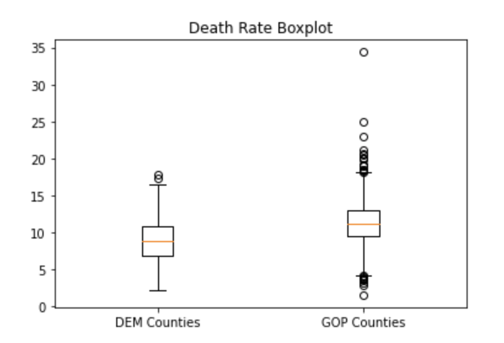

We found that for GOP counties, the median Bachelor&#39;s Rate is slightly lower, and the median Death Rate is slightly higher compared to DEM counties.

We were also curious to see the number of GOP and Democrat numbers in each region which led us to plotting the following bar graphs. The results of the bar graph were somewhat surprising since we thought the difference in the number of DEM vs. GOP would be much greater based on the region. In reality, the margin between the number of people who voted for each party in each region is not significant. 

  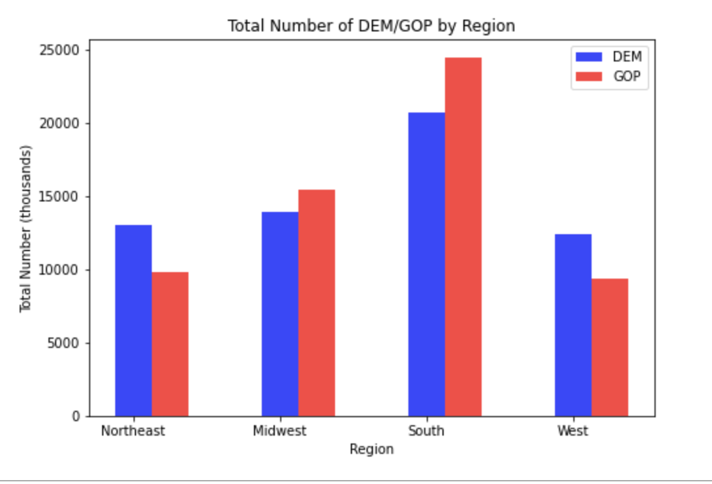

### IV. Solving the Problem

**Introduction**

We decided to use k-Nearest Neighbors, Decision Trees, Gradient Boosting, Explainable Boosting Machines, and Graph Neural Networks as our models to predict swing county behavior. We decided to use most of the features given in the dataset (i.e. Median Income, Bachelor Rate, Migration Rate, etc.) since they seem to all be significant in affecting county behavior. After finding the accuracy of these models, we created visualizations, including ROC curves and maps to display the accuracy of our predictions of counties that swung in 2016.

  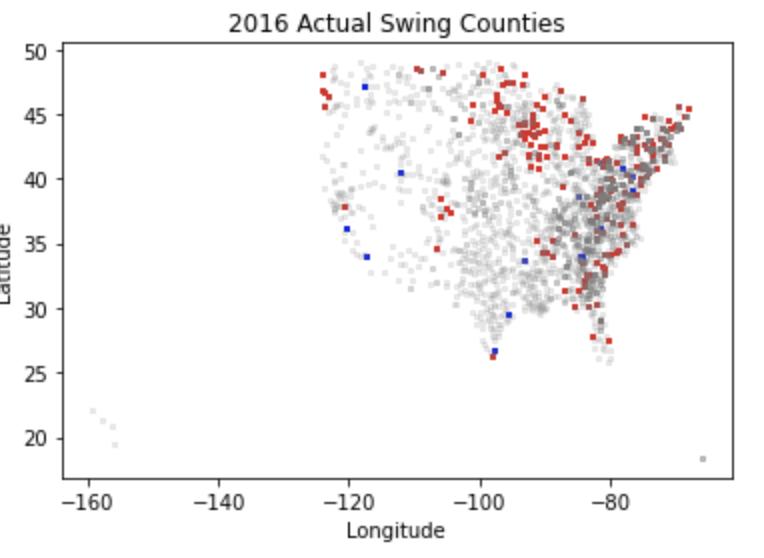

For our map visualizations, we decided to cut out Alaska to make our maps clearer. In addition, we assumed that most of the Alaska counties would not have swung, which shouldn&#39;t affect our model that significantly. Overall, there were 20 counties which swung Democrat and 219 counties swung Republic. This map serves as a good benchmark to compare our models to.

**Model 1: k-Nearest Neighbors**

Firstly, we explore the assumption that our data is segregated into clusters; counties with similar features would likely display similar voting patterns. We first tried out the k-nearest neighbors algorithm based on this assumption. To control overfitting, we normalized each column so that no particular feature would carry more weight based on its magnitude. Additionally, we randomly split the data into training, validation, and testing sets, and ensure that the data isn&#39;t overfitting on the train set such that the difference between our train and validation splits are too great. Next, using the train and validation splits, we fine tune our parameter k; our model manages to achieve 91.14% test accuracy.

However, we note that there is a vast imbalance among our dataset; only 14.85% of the counties have a democrat majority, while the remaining 85.14% is republican. We thus rely more on the weighted accuracy based on each class: the same model achieves a weighted test accuracy of 89.35%.

Lastly, we wanted to see if using temporal data would help with our model performance. We incorporated the election results from 2012, as well as the change in all our features (i.e. change in MedianIncome, etc. for each county), and managed to get a final test accuracy of 94.91%, as well as a weighted test accuracy of 89.16%.

  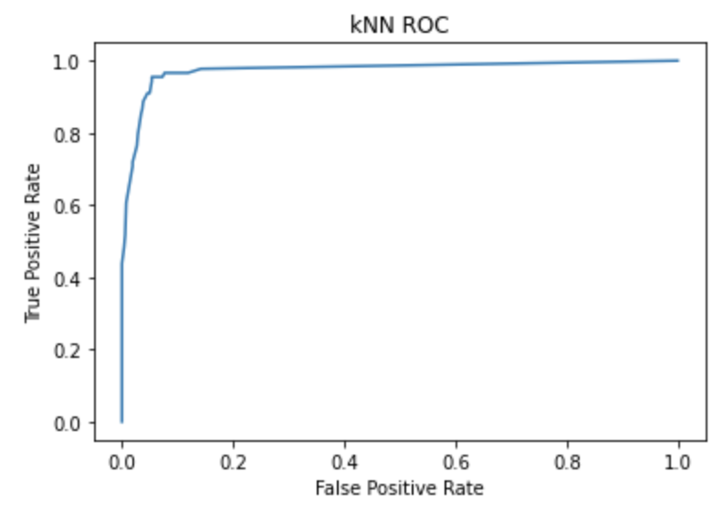

We now analyze the failures of our model: although the final test accuracy increased slightly, the weighted accuracy had little change. Based on the confusion matrix, we noticed that the model without temporal data performs terribly on republican states, as it makes 48 false positives (and only 6 false negatives). Incorporating the temporal data managed to reduce the false positives down to 13, but increased the false negatives up to 18 misclassifications. We deduce that this might be due to the kNNs not being able to fit the complex data sufficiently, thus opted for a more complex approach next. We also plotted the following ROC curve, which has an AUC of 97.41%, with the purpose of comparing with future models. 

  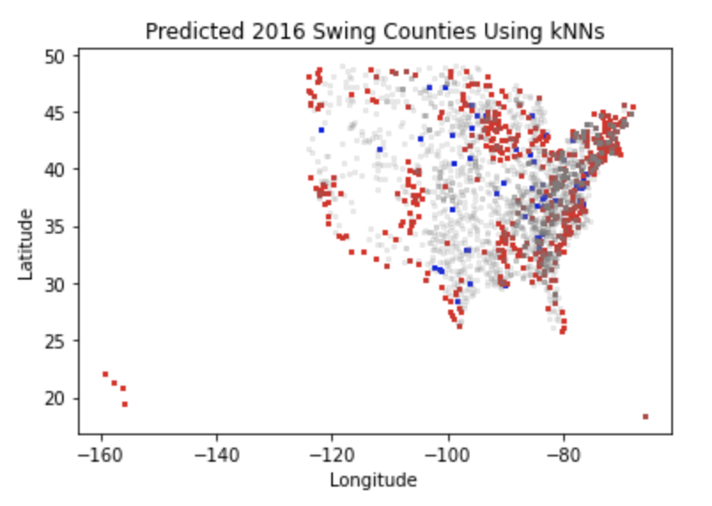
  

After creating our map, the model shows a 85.13% weighted accuracy of the swing counties, with 74 counties that swung Democrat and 588 counties that swung Republican. 

**Model 2: Decision Trees**

As introduced in section 5, classification trees seem to be a good alternative for fitting clusters of data, but with way more complexity. We prevent overfit by fine tuning on the maximum depth achievable by each tree, as well as the minimum number of samples required for each node -- both these parameters ensure that our tree will cater less to each training county specifically.

  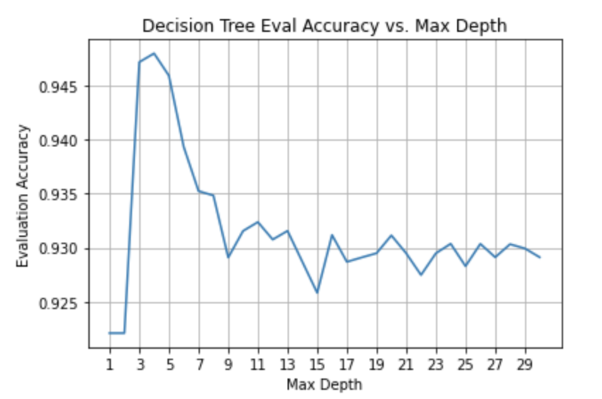

However, compared to kNNs, we only obtained a slightly higher accuracy of 95.24%, and weighted test accuracy of 89.79%. The confusion matrix shows that the number of false positives and false negatives only reduced by one each, but due to the stochastic nature of our splits, the decision trees occasionally perform the same as our kNN as well. The ROC curve, with an AUC of 97.03%, is similar to that from the kNNs. Therefore, we decided to try and improve specifically upon the consistent misclassifications of our model via boosting.

  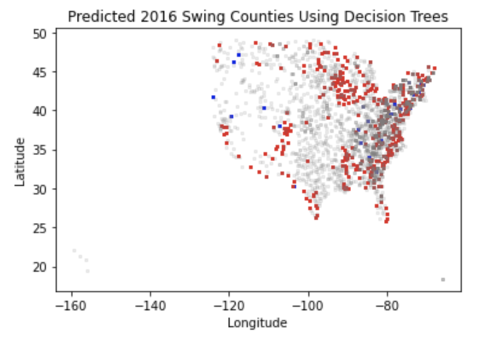
  

After creating our map, our model shows an 89.83% weighted accuracy for predicting the swing counties, with 54 counties predicted to have swung Democrat and 444 counties that swung Republican.

**Model 3: Boosting Methods**

In addition to controlling the complexity of the tree as the previous model, we now also fine tune the number of estimators used by gradient boost. After doing grid search on the parameters, we managed to obtain a slight increase in test and weighted test accuracy of around 0.5%. We also see a very slight improvement in the ROC curve, which now has an AUC of 98.24%. From the confusion matrix, it seems that we managed to again reduce the false positives and false negatives by around 1 or 2; however, we decided that the black-box nature of ensemble models is somewhat troublesome to troubleshoot for problems with our approach, and also tried a more glass-box approach.

  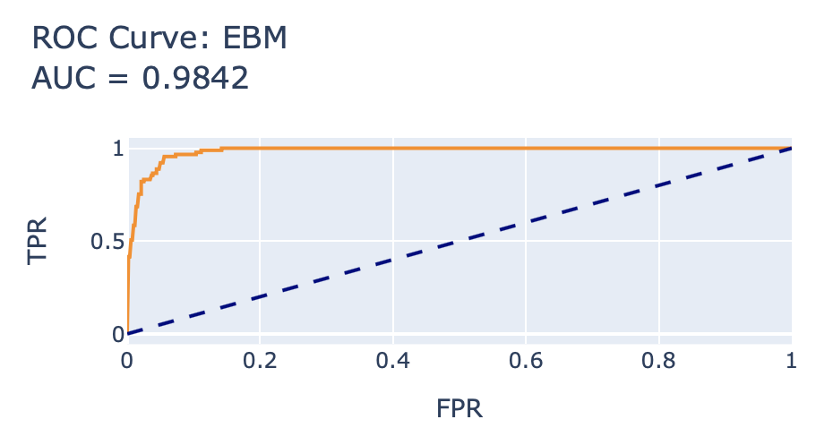
  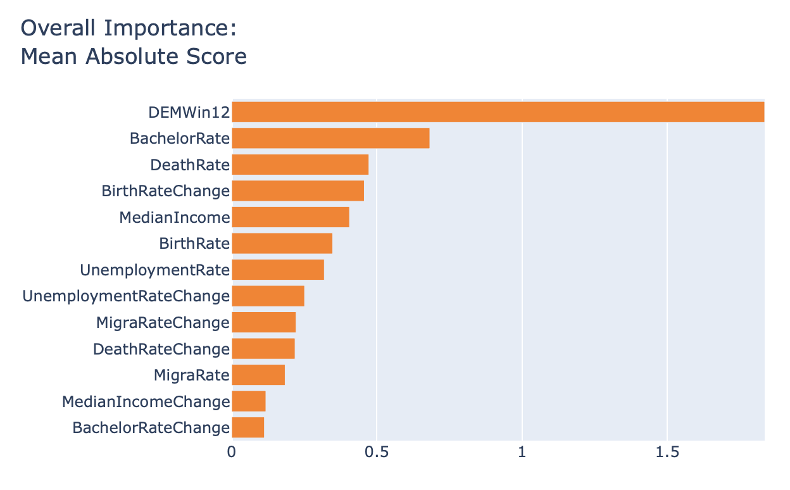

We train an explainable boosting machine (EBM) on our dataset to get a more intuitive understanding of our data and model as well as its shortcomings. Firstly, we noticed that overall, the voting patterns from 2012 seem to provide the most explanatory power for our model; this makes sense, since only a fraction of the counties are swing counties. 

Additionally, the EBM seems to perform equally as well as gradient boost, with an equivalent AUC as shown. This supports what we learned in class, where EBMs were said to have performance equal to ensemble methods such as bagging and boosting.

  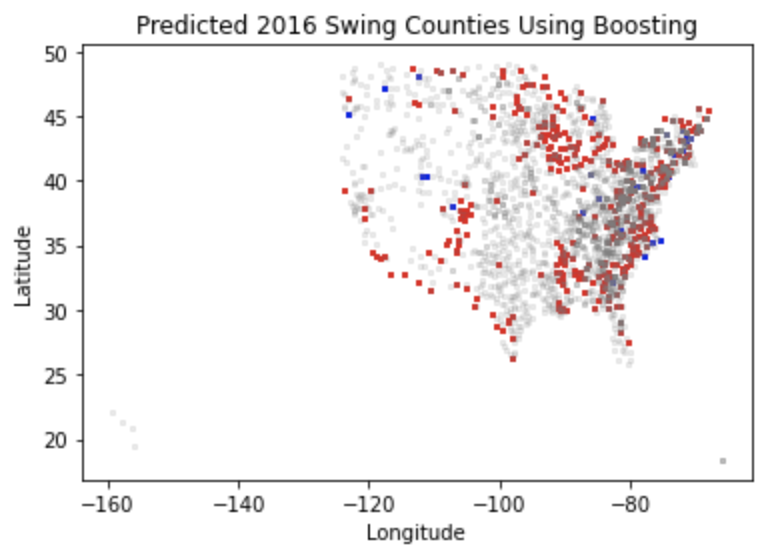
  

After creating our map, our model shows a 87.27% weighted accuracy of the swing counties, with 60 counties that swung Democrat and 440 counties that swung Republican.

**Model 4: Graph Neural Networks (GNNs)**

Lastly, we opted to use a graph neural network for fitting the data. A brief overview of how the network is structured is available [here](https://tkipf.github.io/graph-convolutional-networks/). We managed to obtain a graph on all the counties in the US, where counties adjacent to each other are connected by an edge. We noticed that the graph is quite homophilic (i.e. counties with similar voting patterns are close to each other, as shown in the data analysis section); therefore, although neural networks have much less interpretability compared to EBMs, we theorized that the additional network information would help improve our model performance.

  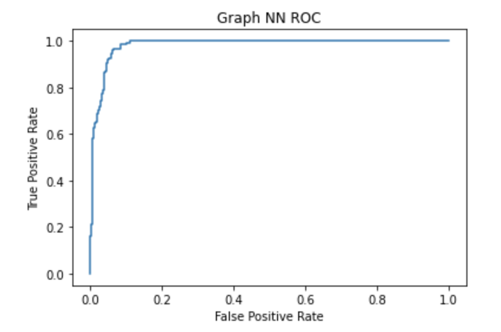

To prevent overfitting, we closely monitored the training and validation errors as the model trained, and restricted our model complexity based on the difference between the train and validation accuracies during training. We ended up with a model with a single hidden layer of 6 nodes, and used rather aggressive dropout layers to reduce overfitting the training data. This network managed to obtain a slightly lower test accuracy of 93.87%, but higher weighted test accuracy of 94.08%, which is the highest weighted accuracy so far. The improved weighted accuracy is likely from our loss function construction, where we used a loss with weights on each class (DEM/GOP) based on their respective inverted frequencies. We also obtained a rather similar ROC curve as the EBMs, with an AUC of 98.94%, since we traded off the general test accuracy for a higher weighted test accuracy. 

  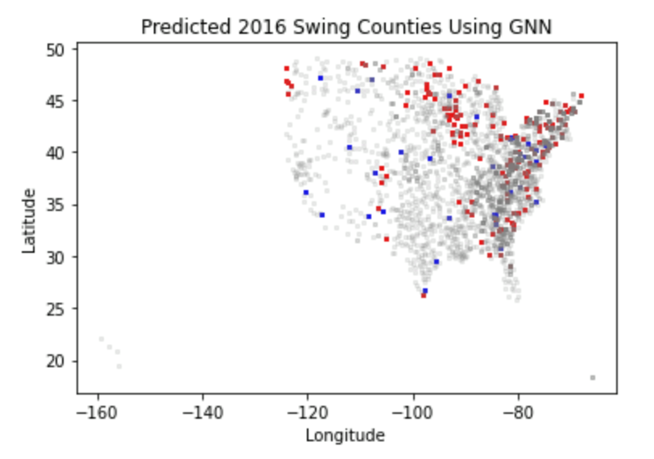
  

After creating our map, our model shows a 94.18% weighted accuracy of the swing counties, with 39 counties that swung Democrat and 157 counties that swung Republican.

**Further Analysis**

Looking at the three models we used, the kNN seemed to have the highest test accuracy of 95.24%, whereas the graph neural network had the highest weighted accuracy with 94.08%. The slight differences between our models and actual results can be explained by a few reasons. First, there is bias present given that 2012 was a year in which Obama, a Democrat, won the election. In addition, the 2016 election results were unexpected to most predictions, so more counties swung Republican than most models could have predicted. These errors could possibly be alleviated by training our models on multiple datasets which include what both Republican and Democrat election victories look like.

### V. Other Considerations

**Weapon of Math Destruction**

In order to decide whether our classifier qualifies as a Weapon of Math Destruction, we will consider the three criteria from lecture.

_Is our model interpretable?_ Some of our methods (i.e kNN, Decision Trees, Explainable Boosting Machines) give insights into how predictions are made. However one of our best models, the Graph Neural Network, has far too many parameters to truly understand the reasoning behind its predictions. Our dataset being primarily demographic information also raises the question of bias being encoded into our model.

_Does our model cause harm?_ Continuing with the idea of bias in a Graph Neural Network, it is possible that our algorithm could lead to the unfair targeting of certain groups with political advertisements. While factors like race statistics are not included per county, these can be correlated to things such as Bachelor Rate and Median Income. This latent effect would be seen in all our models, but the GNN is especially dangerous because we wouldn&#39;t be able to know how the model made its decision (bias is easier to mask).

_Does our model create feedback loops?_ Not especially. It might be the case that if a county were to be classified as a swing county that more resources are funneled into campaigning in that specific county, which could lead to more polarization. However this phenomenon isn&#39;t seen much on the county scale, and advertisements from political campaigns don&#39;t directly impact the demographics of a county so our models are safe in that regard.

Overall, our models can be used in a way that warrants serious ethical considerations. These effects can be mitigated by avoiding the less interpretable GNN and opting for simpler models. Even with these simpler models, the results should be analyzed to assure racial biases are left out of the model&#39;s decision.

**Fairness**

To define the fairness of our models, we choose to model racial makeup of a county as a protected attribute. To make this concept generalize better to the county scale (what is the &quot;race&quot; of a county), we choose the binary attribute to be whether a county has majority white voters. These data were acquired from the U.S Census Bureau&#39;s &quot;Annual County Resident Population Estimates by Age, Sex, Race, and Hispanic Origin: April 1, 2010 to July 1, 2012&quot;. We found that approximately 95% of counties in the US are majority white, which can greatly reduce accuracy for estimating our classifier&#39;s accuracy given the disparity in sample sizes.

Our method is as follows. We aim to test whether our classifier assigns decisions independent of our protected attributes. Therefore, we will create estimates for P(ŷ|y=1,a=1) and P(ŷ|y=1,a=0) from our prediction vectors (this is equivalent to &quot;Equality of Opportunity&quot; from lecture). This particular metric was chosen to assess whether our classifier would be more likely to predict a Democratic win for majority white counties in comparison to others. These probabilities will only be estimated for the GNN, with the logic being that other models we&#39;ve used are much more interpretable, so we can easily check whether it is heavily weighting the factors that are more correlated with race. Our findings are:

- P(True Positive | Majority White) = 0.97
- P(True Positive | Not Majority White) = 0.99
- P(False Positive | Majority White) = 0.02
- P(False Positive | Not Majority White) = 0.005

These results seem to indicate that counties that are not majority white have higher incidences of true positives (correctly predicts Democrat win) than majority white counties. However, this should be taken with a grain of salt since while we can&#39;t apply standard confidence interval methodology (independence assumption fails) the probabilities are too close to definitively say our model fails Equal Opportunity. Additionally, the GNN made very few misclassifications, which in combination with the low proportion of non-majority white counties leads to very small sample sizes. Therefore we can conclude that the GNN is relatively fair if race is our protected attribute.

### VI. Future Work and Conclusion

At the moment, we would not be willing to use our results in production. This is because there are a few things we could still do to further improve our models and eliminate potential bias, as explained below.

Firstly, while we did some feature selection among the given features, there is still some room for feature transformations such as including interaction variables between the features or taking a power of the feature. Additionally, we could try training an embedding framework such as node2vec; we think that this would produce better representations of the county network that might lead to increased performance of the graph neural network. Secondly, most of the attempts above represent our problem as a pure classification problem. But a county with 100 DEM votes and 101 GOP votes differs greatly from a county with 1 DEM votes and 200 GOP votes; we think that framing the question as a regression problem, where the ground truth is the `DEM count - GOP count`, would allow our models to take the confidence of its predictions into account, and classification would be simply done by taking the sign of our regression outputs.

In conclusion, our models produce predictions with accuracies of at least 90%, with our best model being graph neural networks. From our visualizations, we see that our models predict many of the swing counties correctly, including both Democratic and Republic swing counties. However, it is important to note that while our models are relatively fair with race as our protected attribute, they still may include biases and could be used in a way that warrants serious ethical considerations. Once we eliminate such risks and additionally improve our models in the way stated above, these results could be beneficial for political campaigns who would like to know which counties to target for advertising.

### A. Appendix

Residual Correlation in Graph Neural Network Regression. Junteng Jia and Austin R. Benson.

Proceedings of the ACM SIGKDD International Conference on Knowledge Discovery and Data Mining (KDD), 2020.

&quot;Annual County Resident Population Estimates by Age, Sex, Race, and Hispanic Origin: April 1, 2010 to July 1, 2012&quot; US Census Bureau