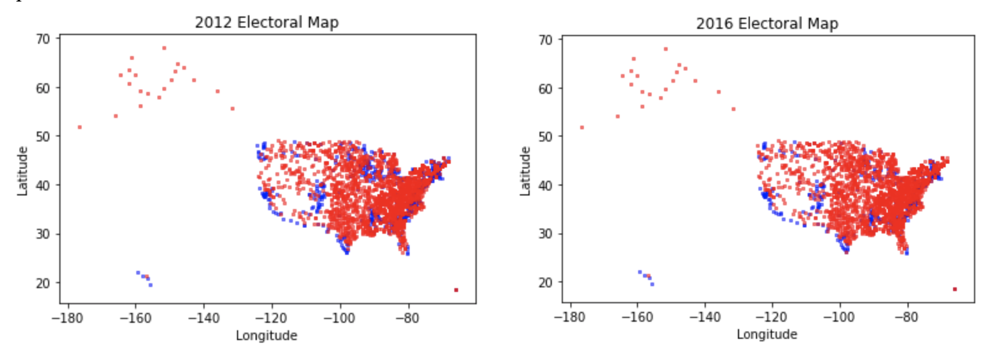
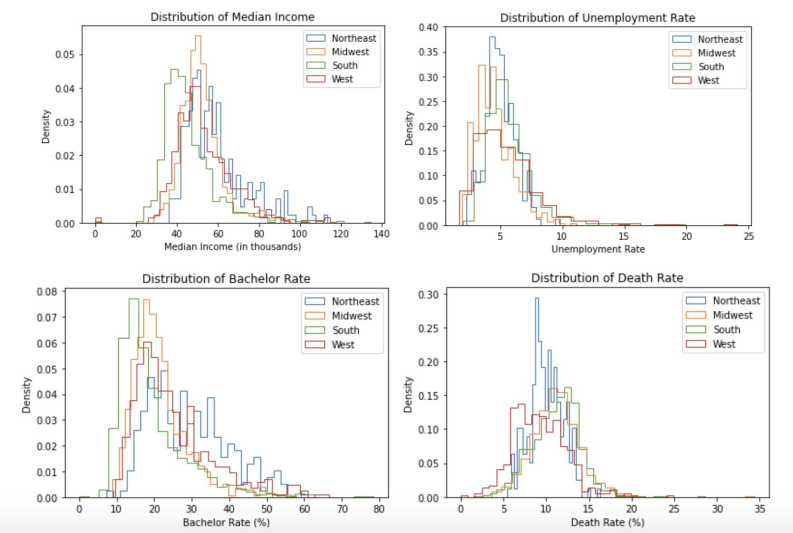
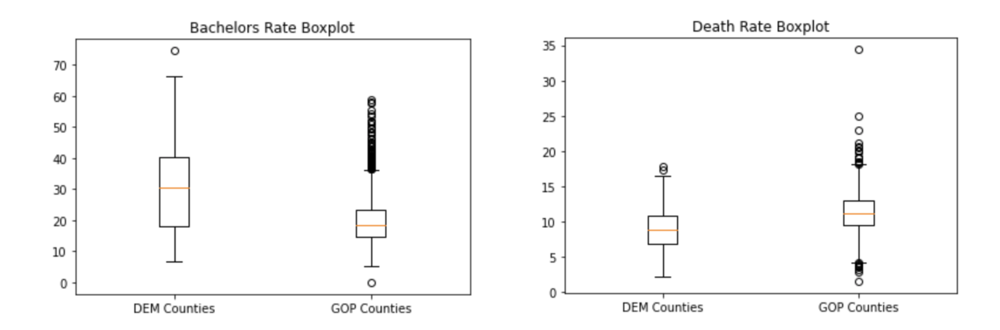
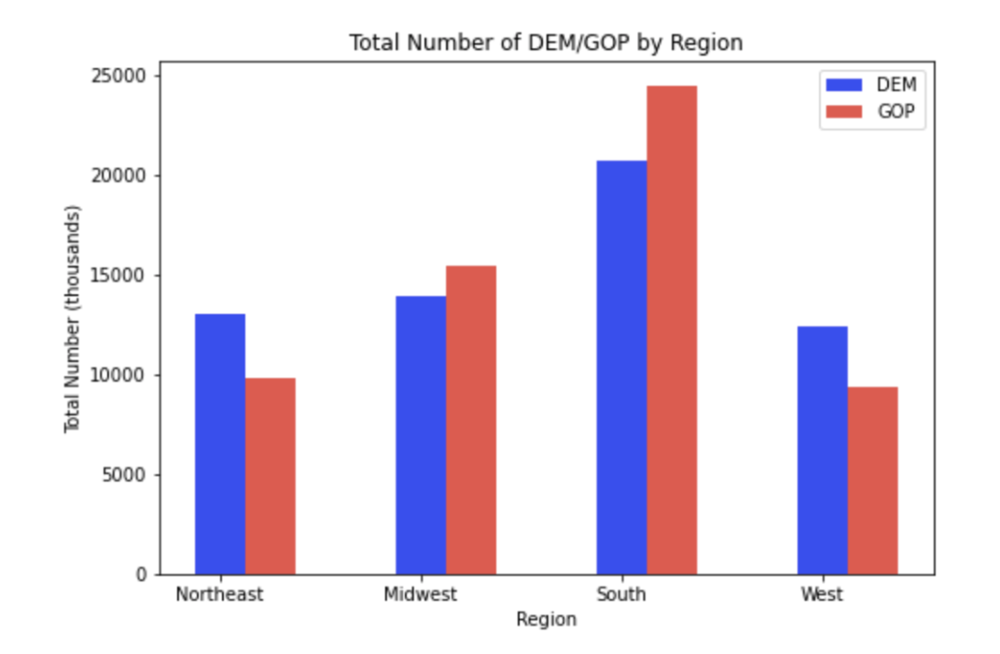
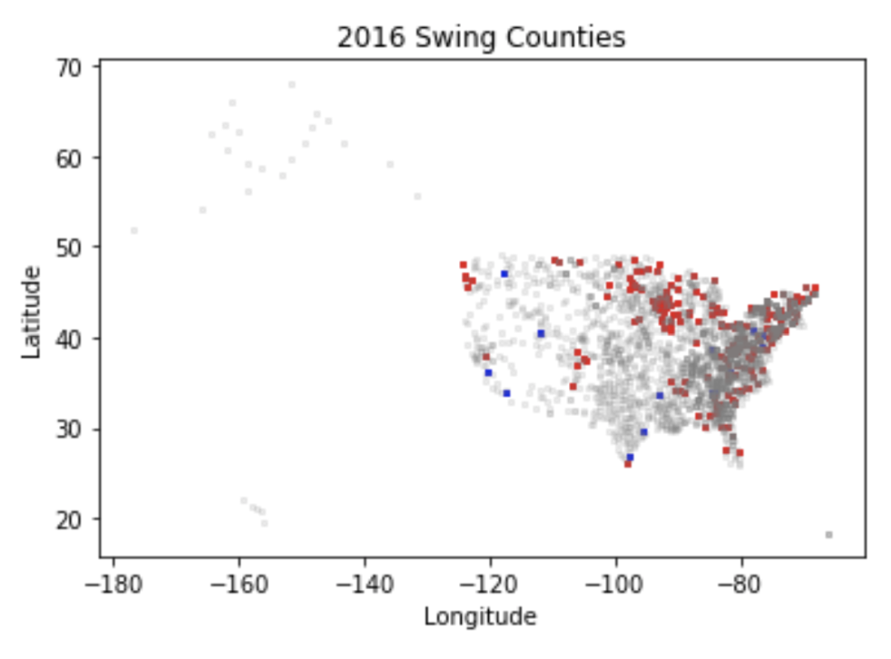

## ORIE 4741 MIDTERM REPORT

Christopher Archer (caa234), Zoe Pan (zp45), Jia Jiunn Ang (ja497)

NOTE FOR READERS: Our proposal was originally on the Genius.com dataset, but ultimately we decided the dataset was too complex for a quality analysis to be done. Instead, we chose a US county demographics dataset.

**Introduction**

On any campaign, it is vital to strategically allocate resources to ensure a victory while minimizing overall cost. We have data consisting of electoral numbers for every county in America along with demographic information such as education level, migration rate, and median income. In this paper, our goal is to better understand this dataset, with the intention of ultimately creating a classifier for _swing counties_, counties that are most likely to switch their vote from election to election. This could be especially useful for campaigns, as those counties would be the target of the bulk of their advertising resources.

**The Data**

Our data is split into three separate files. The first two, _county\_data\_2012.csv_ and _county\_data\_2016.csv_, are simply the demographic info of all counties from the 2012 and 2016 presidential elections. The columns of this dataset are: County, Democratic votes (DEM), Republican votes (GOP), Median Income, Migration Rate, Birth Rate, Death Rate, Bachelor Rate (% with bachelor&#39;s degree), and Unemployment Rate. Some extra preprocessing was done such that only counties eligible to vote are included, leaving us with 3143 counties overall. These data were also merged with county geodata such as latitude, longitude, primary city, and estimated population. We found our data after preprocessing had only 73 counties (<3%) missing electoral information, which we thought was sufficient to remove. We use the geocoded data to reconstruct an &quot;election map&quot; below.

Our third dataset _county\_graph.csv_ contains pairs of counties, where pair _(i,j)_ represents whether county _i_ shares a border with county _j_. This can be used to represent the United States counties as an undirected graph, which has many interesting implications for modelling. We will discuss this further in our &quot;Future Work&quot; section.

**Understanding the Data**

For some initial data visualizations, we decided to focus on the 2016 dataset (since demographics haven&#39;t changed that much since 2012). Our group sought to create distributions of each column based on region (Northeast, Midwest, South, and West) to see if there was anything significantly different, and if we could find spatial correlations for voting preference.

There are a few notable differences in the visualizations. In the Median Income and Bachelor Rate histograms, we can see that the mean of the South region is slightly lower than the rest of the regions. In the Death Rate histogram, the Northeast region is slightly lower than the rest of the regions. Overall, most of the histograms didn&#39;t have significant differences among regions.

To further understand our data, we created box plots for demographic information split on which party the county&#39;s majority voted for. Among our features, we only found Bachelor&#39;s Rate and Death Rate to be significantly different, as shown below.

We found that for GOP counties, the median Bachelor&#39;s Rate is slightly lower, and the median Death Rate is slightly higher compared to DEM counties.

We plot the following bar graph to show the distribution of voters for each party among different regions. Surprisingly, the margin between the number of people who voted for each party in each region is not significant.

  

**Introductory Modeling**

We now run some preliminary models on the dataset. For each county, we first identified the party which received the majority vote (DEM/GOP), and narrowed down our problem to predicting the winning party for different counties.

We ran principal component analysis to find the distribution of explanation power for picking our features. Next, we theorized that since counties with similar party votes are somewhat grouped together, a kNN would work well for our use case. We found that the kNN method achieves around 85.2% accuracy on test data split from the 2016 dataset. To improve on this idea of clustering, we tried using decision trees, which yielded a lower accuracy of 84.5% using 50-fold validation. We then improved upon our decision trees using random forests on our data -- which yielded a better performance of 89.2% accuracy.

Nevertheless, the model&#39;s confusion matrix showed that we have a higher false negative rate of 0.08%, compared to the false positive rate of only 0.01%. We thus tried using boosting methods to improve our model -- in particular, we managed to achieve 90.1% test accuracy using gradient boosting, which is our current best model performance.

Additionally, we tried using further ensemble learning techniques such as stacking, as well as other classification models including logistic regression, LDA, QDA, and SVMs. We ultimately ended up with model accuracies of between 86.2% to 87.7%, which is still lower than our highest accuracy model -- but we think that with further data pre-processing and the right feature transformations, we can definitely improve upon these test accuracies.

**Future Work**

  

Finally, we created another map that displays the counties that swung in the 2016 election.

Overall, there were 20 counties which swung Democrat and 219 counties swung Republic. Given that our goal is to eventually predict county voting behavior, this visualization shows us which counties to focus more on after we create our models. In particular, we could potentially use bootstrapping/stratified sampling to overcome data sparsity among swing counties (<8% of counties are swing counties).

Moving forward, we plan to:

- Examine a graph-based prediction approach which considers spatial proximity between counties
- Implement additional feature transformations
- Train with the 2012 dataset to predict on 2016 election results